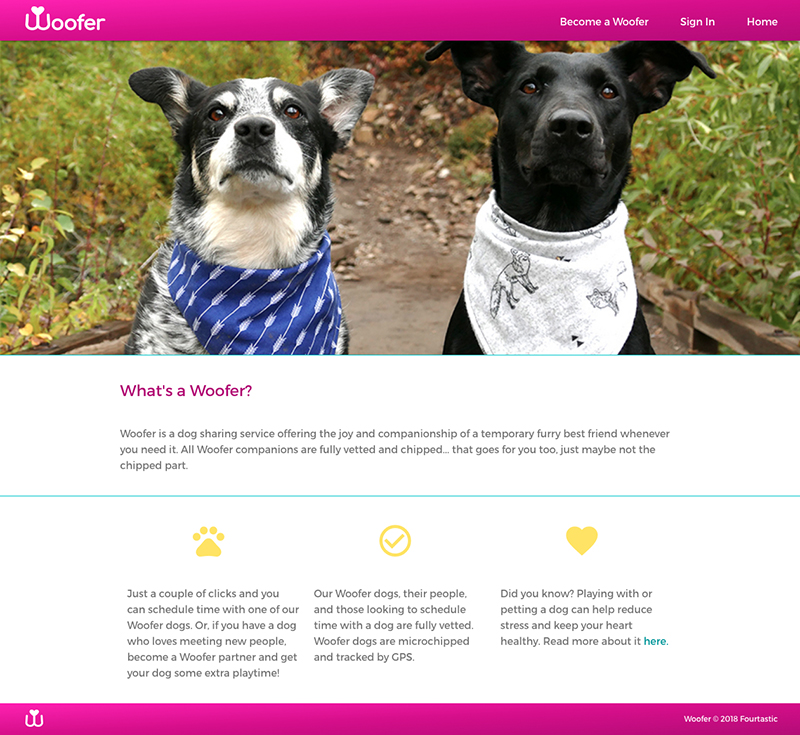

# Woofer Dog Sharing App
#### By Fourtastic

### Team Members
- Carlos Bejar (El Jefe, Front End and Back End Support)
- Christine Pablo (Admin Support, Design, and Front End)
- German Gamboa (Back End Architect and Lead)
- Roshnee Acevedo (Back End and Front End Support)

### What is this?

Woofer is a dog sharing service that offers the joy and companionship of a canine best friend whenever you need it.

View the [Woofer App here](https://woofer-2018.herokuapp.com/)

### How does it work?

If you're a Woofer User                           | If you're a Woofer Partner
------------------------------------------------- | ----------------------------------
create a User profile                             | create a Partner profile
search for dogs in the area to schedule time with | add your dog to share in Partner Profile
select dog(s) and send request to Partner         | receive and view requests in Partner Profile
ability to message Partner regarding request      | accept or decline requests

### Homepage Screenshot

### Technologies Applied

* [Vue.js](https://vuejs.org/)
* [Materialize CSS](https://materializecss.com/)
* [Sequelize](http://docs.sequelizejs.com/)
* [Cloudinary](https://cloudinary.com/)
* Node
* Express
* Axios

### Build Setup

##### install dependencies
npm install

##### serve with hot reload at localhost:8080
npm run dev

##### build for production with minification
npm run build

##### build for production and view the bundle analyzer report
npm run build --report

##### homepage carousel
npm install [vue-agile](https://github.com/lukaszflorczak/vue-agile)

For a detailed explanation on how things work, check out the [guide](http://vuejs-templates.github.io/webpack/) and [docs for vue-loader](http://vuejs.github.io/vue-loader).
